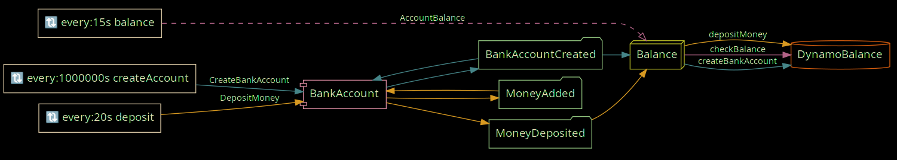

# Mongo Dynamo Springboot Example

This is an example SpringBoot application using the Mongo DynamoDB extension. It uses DynamoDB as the Event- and Token Store.



This example project has been adapted from the example project in axon [mongo extension][mongo extension]

## How to run

### Preparation

You will need `docker` and `docker-compose`for this example.

To start a local instance of DynamoDB with axon event store table (in axon-example package): 

```bash
docker-compose -f ./axon-dynamodb-example/docker-compose.yaml up -d  
```

Next, run the application:

```bash
mvn clean package -f ./axon-dynamodb-example
```

### Running example application

You can start the application by running `java -jar ./axon-dynamodb-example/target/axon-dynamodb-example.jar`.

