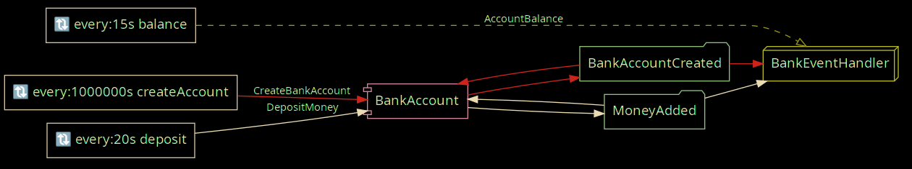

# Mongo Dynamo Springboot Example

This is an example SpringBoot application using the Mongo DynamoDB extension. It uses DynamoDB as the Event- and Token Store.



This example project has been adapted from the example project in axon [mongo extension][mongo extension]

## How to run

### Preparation

You will need `docker`.

To start a local instance of DynamoDB: 

```bash
docker run -p 8000:8000 amazon/dynamodb-local -jar DynamoDBLocal.jar -sharedDb 
```

Next, run the the application:

```bash
mvn clean package -f ./mongo-axon-example
```

### Running example application

You can start the application by running `java -jar ./mongo-axon-example/target/mongo-axon-example.jar`.

You can access the mongo-express UI
on [http://localhost:8081/db/axonframework/](http://localhost:8081/db/axonframework/)
where you can see the tables used by axon and inspect events, tokens and snapshots.


 [mongo-extension]: https://github.com/AxonFramework/extension-mongo